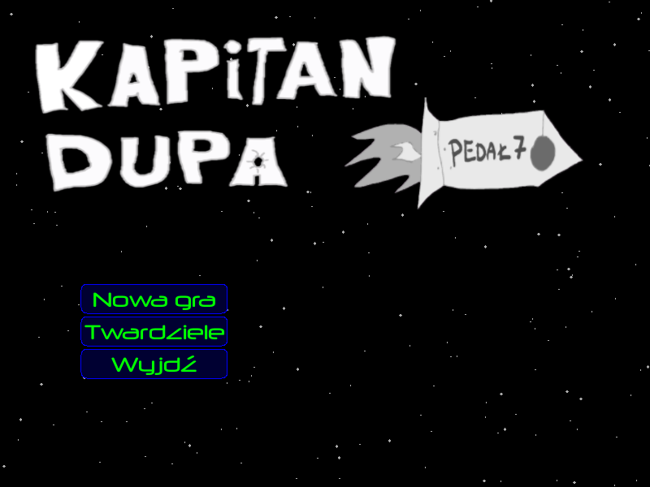
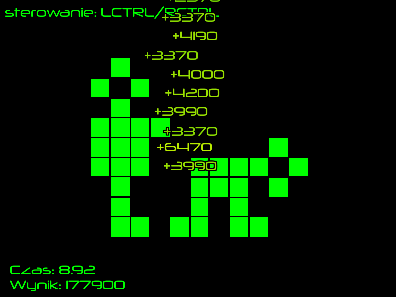

# Kapitan Dupa

gra dla prawdziwych twardzieli




# wymagania sprzetowe

- klawiatura i mysz
- monitor SVGA (800x600)
- Microsoft® Windows™ 2000 lub nowszy (może być piracki)
- Intel® Pentium™ III 800 MHz lub lepszy
- karta graficzna zgodna z DirectX® 8
- 128 MB RAM
- 15 MB miejsca na dysku


# build (arch linux)

wymagania: gcc 12, cmake 3.20

starszych nie sprawdzalem huj wie moze dziala

```
sudo pacman -S allegro5 nlohmann-json
cmake -Bbuild
cd build
make -j$(nproc)
```

# build (windows)

development pack coming soon na razie trzeba se samemu ogarnac

# maintenance warning

kod zawiera chamska duplikacje i inne zbrodnie wojenne
